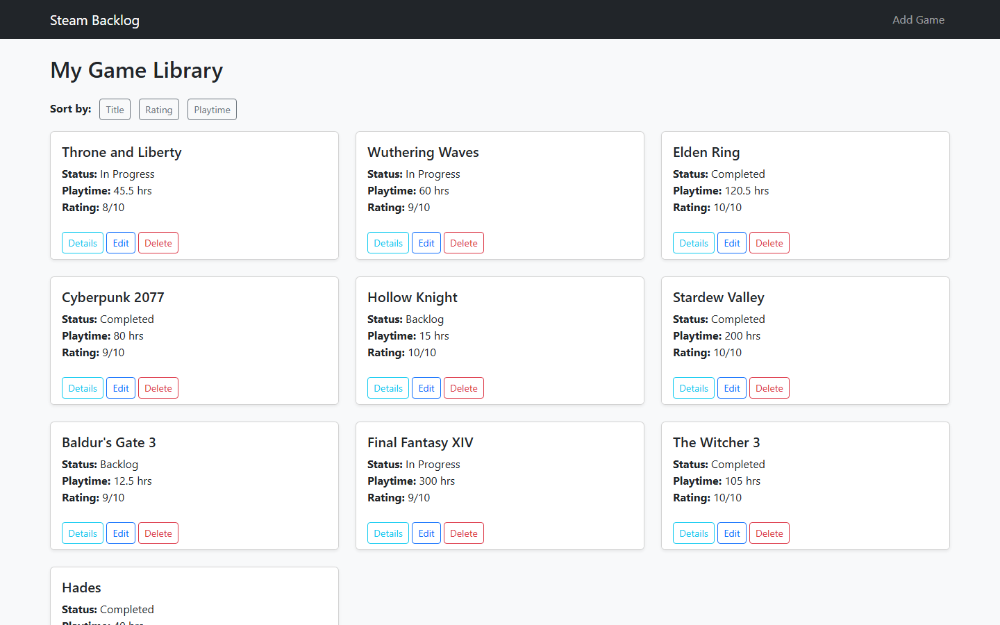

# Steam Backlog Manager

McMaster University **4WP3** (Web Programming) project. A server-rendered web app for tracking a game
backlog: what you're playing, what you've finished and what's next.



## Features

- Add, view, edit and delete games with their status, playtime and personal rating
- Sort the library by title, rating or playtime
- MVC structure: Express routes in `app.ctrl.js`, SQLite queries in `app.model.js`, Mustache views in
  `views/`
- Backend validation: required title, non-negative playtime, rating from 1 to 10, with the form
  re-rendered showing the error
- Bootstrap styling

## Tech

Node.js, Express, SQLite, Mustache (mustache-express), Bootstrap

## Run

```bash
npm install
node app.ctrl.js
```

Then open http://localhost:3000. `database.db` includes sample games.
